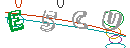
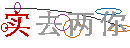

# luoluo-captcha

**落落**（luoluo）取自成语“落落大方”，寓意自然、大方、毫不拘束。本库也希望像这个名字一样，为你提供一种简单、直接、优雅易用的验证码方案。

一个纯 JavaScript 实现的 Node.js 图形验证码库，无需安装 canvas 等原生模块。

支持 5 种验证码类型：`SpecCaptcha`、`GifCaptcha`、`ChineseCaptcha`、`ChineseGifCaptcha`、`ArithmeticCaptcha`。

**本库不保存、不管理验证码答案，仅生成图片并返回正确答案。答案需要由调用方自行保存（session、Redis、内存等方式），并自行比对校验。**

## 特性

- 纯 JS 实现，无需 `canvas` 或 `@napi-rs/canvas` 等原生依赖
- 支持 PNG 静态图与 GIF 动态图
- 支持中文验证码（需系统中文字体或自定义字体文件）
- 支持算术验证码，可配置运算位数
- 不保存答案，由调用方自行管理验证流程

## 快速开始

### 基础用法

```ts
import { SpecCaptcha, GifCaptcha, ChineseCaptcha, ChineseGifCaptcha, ArithmeticCaptcha } from 'luoluo-captcha';
import * as fs from 'fs';

// 1. SpecCaptcha（PNG，英文数字混合）
// 默认：宽130、高48、长度4
const spec = new SpecCaptcha();
fs.writeFileSync('spec.png', spec.toBuffer());
console.log('答案:', spec.text()); // 例如 "A3B7"
```


```ts
// 2. GifCaptcha（GIF，英文数字混合，逐帧高亮字符）
const gif = new GifCaptcha();
fs.writeFileSync('gif.gif', gif.toBuffer());
console.log('答案:', gif.text());
```



```ts
// 3. ChineseCaptcha（PNG，中文汉字）
// 需要中文字体支持。库会自动检测系统字体。
const chinese = new ChineseCaptcha();
fs.writeFileSync('chinese.png', chinese.toBuffer());
console.log('答案:', chinese.text()); // 例如 "的一是了"
```


```ts
// 4. ChineseGifCaptcha（GIF，中文汉字）
const chineseGif = new ChineseGifCaptcha();
fs.writeFileSync('chinese.gif', chineseGif.toBuffer());
console.log('答案:', chineseGif.text());
```



```ts
// 5. ArithmeticCaptcha（PNG，算术表达式）
// 默认：宽130、高48、长度2（即一个运算符）、digits=1（0-9）
const arithmetic = new ArithmeticCaptcha();
fs.writeFileSync('arithmetic.png', arithmetic.toBuffer());
console.log('答案:', arithmetic.text()); // 例如 "8"（计算结果）
console.log('算式:', arithmetic.getArithmeticString()); // 例如 "5+3=?"
```


### 自定义参数

```ts
// SpecCaptcha / GifCaptcha / ChineseCaptcha / ChineseGifCaptcha
// 构造函数：width, height, length, fontPath
const captcha = new SpecCaptcha(130, 48, 6, '/path/to/font.ttf');

// ArithmeticCaptcha
// 构造函数：width, height, length, fontPath
// length = 运算数个数（默认 2，即一个运算符）
// digits = 每个运算数的位数（默认 1，即 0-9；2 表示 10-99）
const arithmetic = new ArithmeticCaptcha(130, 48, 2, '/path/to/font.ttf');
arithmetic.setDigits(2); // 运算数范围变为 10-99
fs.writeFileSync('math.png', arithmetic.toBuffer());
console.log('答案:', arithmetic.text()); // 计算结果
```

## API 说明

### 通用方法

所有验证码类均提供以下方法：

| 方法 | 返回值 | 说明 |
|------|--------|------|
| `text()` | `string` | 返回正确答案。算术验证码返回计算结果。 |
| `toBuffer()` | `Buffer` | 返回图片 Buffer（PNG 或 GIF）。 |
| `toBase64()` | `string` | 返回 base64 编码的图片数据（不含 data URI 前缀）。 |
| `out(stream)` | `boolean` | 将图片写入可写流。 |

### SpecCaptcha

```ts
new SpecCaptcha(width?, height?, len?, fontPath?)
```

| 参数 | 默认值 | 说明 |
|------|--------|------|
| `width` | `130` | 图片宽度 |
| `height` | `48` | 图片高度 |
| `len` | `4` | 字符数量 |
| `fontPath` | `undefined` | TTF/OTF 字体路径。不传则使用内置字体，若不可用会抛出错误。 |

### GifCaptcha

```ts
new GifCaptcha(width?, height?, len?, fontPath?)
```

参数与 `SpecCaptcha` 相同。生成动态 GIF，每帧高亮一个字符。

### ChineseCaptcha

```ts
new ChineseCaptcha(width?, height?, len?, fontPath?)
```

| 参数 | 默认值 | 说明 |
|------|--------|------|
| `width` | `130` | 图片宽度 |
| `height` | `48` | 图片高度 |
| `len` | `4` | 汉字数量 |
| `fontPath` | `undefined` | 中文字体路径（TTF/OTF/TTC）。不传则自动查找系统字体，找不到会抛出错误。 |

### ChineseGifCaptcha

```ts
new ChineseGifCaptcha(width?, height?, len?, fontPath?)
```

与 `ChineseCaptcha` 参数相同，但生成动态 GIF。

### ArithmeticCaptcha

```ts
new ArithmeticCaptcha(width?, height?, len?, fontPath?)
```

| 参数 | 默认值 | 说明 |
|------|--------|------|
| `width` | `130` | 图片宽度 |
| `height` | `48` | 图片高度 |
| `len` | `2` | 运算数个数（例如 `2` 表示 `a op b`，即一个运算符） |
| `fontPath` | `undefined` | TTF/OTF 字体路径，用于渲染算式。 |

额外方法：

| 方法 | 说明 |
|------|------|
| `setDigits(digits: number)` | 设置每个运算数的位数。`1` = 0-9，`2` = 10-99，以此类推。 |
| `getDigits()` | 返回当前位数设置。 |
| `getArithmeticString()` | 返回图片上显示的算式文本，例如 `"5+3=?"`。 |
| `text()` | 返回**计算结果**，例如 `"8"`。你需要保存这个值用于后续校验。 |

## HTTP 接口示例

本项目内置了 NestJS 接口，启动后即可直接请求：

```bash
# 英文 PNG 验证码（默认）
curl http://localhost:3000/captcha/spec

# 英文 GIF 验证码
curl http://localhost:3000/captcha/gif

# 中文 PNG 验证码
curl http://localhost:3000/captcha/chinese

# 中文 GIF 验证码
curl http://localhost:3000/captcha/chinese-gif

# 算术 PNG 验证码（默认：一个运算符，0-9）
curl http://localhost:3000/captcha/arithmetic

# 算术验证码：3 个运算数（两个运算符），每位数 2 位（10-99）
curl "http://localhost:3000/captcha/arithmetic?len=3&digits=2"

# 通用接口（通过 type 指定类型）
curl "http://localhost:3000/captcha/image?type=spec"
curl "http://localhost:3000/captcha/image?type=arithmetic&digits=2"
```

响应头 `X-Captcha-Text` 中包含验证码答案（已 URL 编码），由调用方自行保存和校验。

## 答案保存说明

**本库不保存、不校验验证码答案。** 你需要自行调用 `text()` 获取答案并保存，然后与用户输入进行比对。

以下是一个 Express session 的示例：

```ts
import { SpecCaptcha } from 'luoluo-captcha';
import express from 'express';

const app = express();

app.get('/captcha', (req, res) => {
  const captcha = new SpecCaptcha();
  req.session.captcha = captcha.text(); // 自行保存答案
  res.setHeader('Content-Type', 'image/png');
  res.send(captcha.toBuffer());
});

app.post('/verify', (req, res) => {
  const ok = req.body.code === req.session.captcha;
  res.json({ success: ok });
});
```

## NestJS Service（可选）

如果你使用 NestJS，也可以注入 `CaptchaService` 来生成验证码。它会自动读取项目根目录的 `luoluo.yaml` 配置（可选）。

```ts
import { CaptchaService } from 'luoluo-captcha';

@Controller('captcha')
export class CaptchaController {
  constructor(private readonly service: CaptchaService) {}

  @Get('image')
  async getImage(@Res() res: Response) {
    const { image, contentType, text } = this.service.create('spec');
    // 自行保存 text（Redis、session 等）
    res.set('Content-Type', contentType);
    res.send(image);
  }
}
```

## 字体说明

- 内置 10 款英文字体，位于 `fonts/` 目录下。
- `ChineseCaptcha` 和 `ChineseGifCaptcha` 需要中文字体支持。库会自动检测常见系统字体（PingFang、STHeiti、Microsoft YaHei、NotoSansCJK 等）。
- 你也可以通过构造函数的 `fontPath` 参数传入自定义字体文件路径。

## 许可证

MIT
